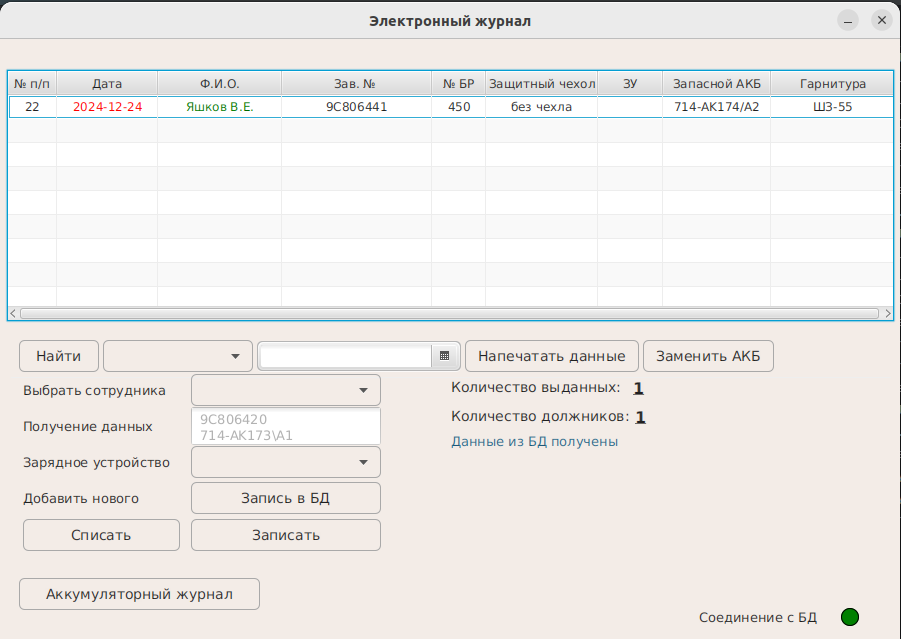
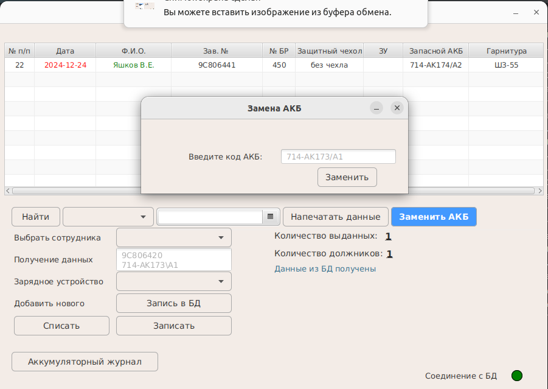
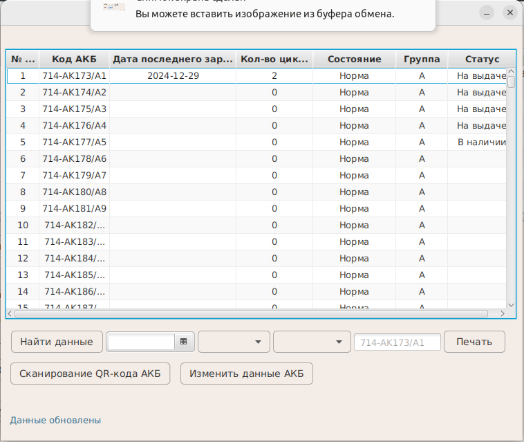

<h1 align="center">Electronic Journal System</h1>
<p>Данное descktop-приложение разработано для электронного учета носимых радиостанций и аккумуляторных батарей.</p>
<p>При помощи 2D сканнера оператор сканирует коды в ПО. При этом из БД находятся данные ноисмой радиостанции и аккумулятора</p>
<p style="color: orangered">Desktop - приложение разработано в целях изучения библиотеки JavaFX и не предназначено для коммерческой деятельности.</p>
<h3>Используемый стек технологий: </h3>
<ul>
<li>Java 17</li>
<li>JavaFX</li>
<li>SQLite</li>
<li>Intellij IDEA</li>
</ul>

<h3>Используемое оборудование:</h3>
<ul>
<li>2D сканнер шрихкодов и QR - кодов MiniCam24 Radella c bluetooth (USB).</li>
<li>Ноутбук с OS Windows 7.</li>
</ul>
<h1 align="center">Процесс сборки проекта в exe файл</h1>
<li style="list-style: none">
    1. Для сборки проекта в exe файл необходимо воспользовался библиотекой 
    <a href="https://sourceforge.net/projects/mingw-w64/">MinGW-W64.exe.</a><br>
    Указываем в переменную среду путь до каталога библиотеки<br>
<div>

    C:\User>set Path=C:\MinGW64\mingw64\bin;%Path%<br>

</div>

  2. Создаем файл ресурсов resources.rc и в ставляем в него следующий код:<br>
        
    001 ICON "my_icon.ico"<br>

><strong>ВНИМАНИЕ: иконка должна находится в томже катологеб где будет лежать файл с ресурсами</strong><br>
    Компилируем файл ресурсов с помощью программы windres.exe:<br>
<div>

     C:\User>windres --use-temp-file -iresourcs.rc -oresources.o
</div>
    3. В этом же каталоге создаем файл runjar.c и вносим код:<br>
    
```
    #include <stdio.h><br>
    #include <process.h><br>
    int main(int argc, char *argv[], char **penv){
    _execl("bin\\javaw.exe", "bin\\javaw.exe", "-jar", "jar\\Project.jar", NULL);
    return 0;
    }
```
4. Далее необходимо произвести сборку всех зависимостей проекта, а также локальную jvm. 

```
    javafx:jlink
```

<p>Данная команда создаст необходимые файлы длс создания дистрибутива.</p>
5. Далее производим сборку проекта при помощи плагина maven-shade:

````
    shade:shade
````

6. Полученный файл jar в каталоге tagret копируем вместе с каталогом app в каталог в котором создаете приложение.
7. Jar файл помещаем в каталог jar.
8. Файл SQLite project.db также помещаем в каталог создания приложения. Создайте и заполните БД SQLite system_app.db.
 <strong>ВАЖНО: В файле SQLite project.db должны обязательно быть заполнены таблицы, иначе при работе приложения будут возникать ошибка</strong>
9. Для сборки в exe файл вводим команду:

```
    C:\\User> gcc -Wall -o3 -mwindows -o C:\project\MyApp.exe runjar.c resources.o
```

После комплиляции в каталоге project буде создан MyApp.exe.
</li>
<h1 align="center">Работа приложения</h1>
<h3 align="center">Окно журнала выдачи носимых радиостанций</h3>

<br>
<h3 align="center">Мондальное окно замены аккумулятора</h3>

<br>
<h3 align="center">Главное окно аккумуляторного журнала</h3>



